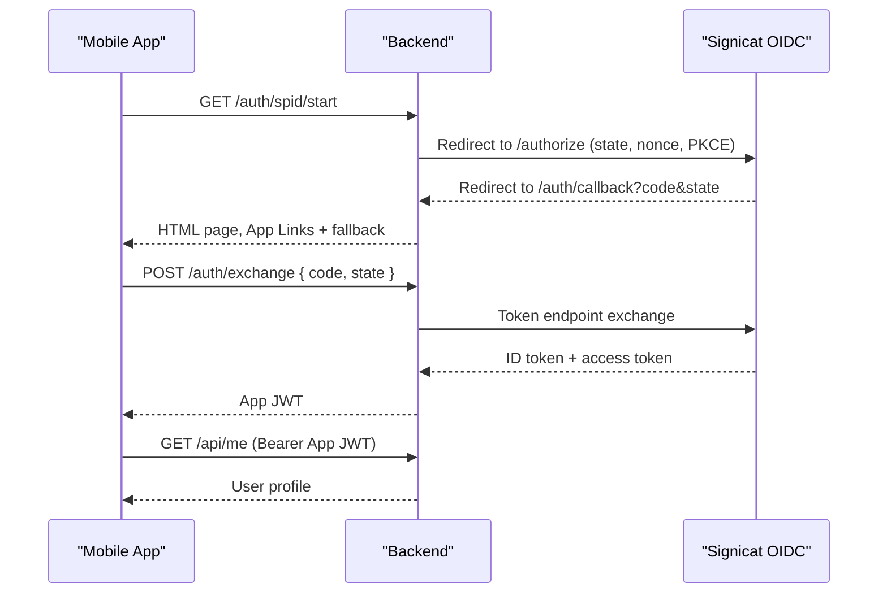
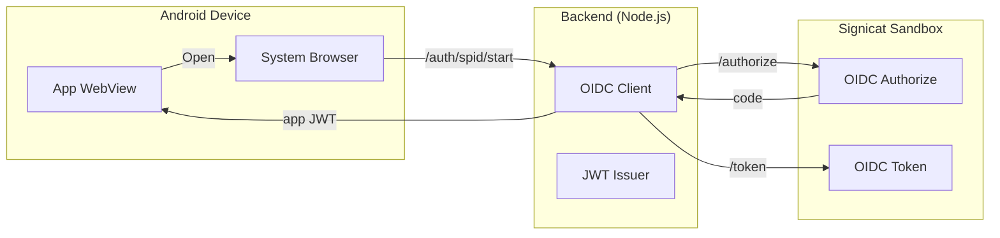
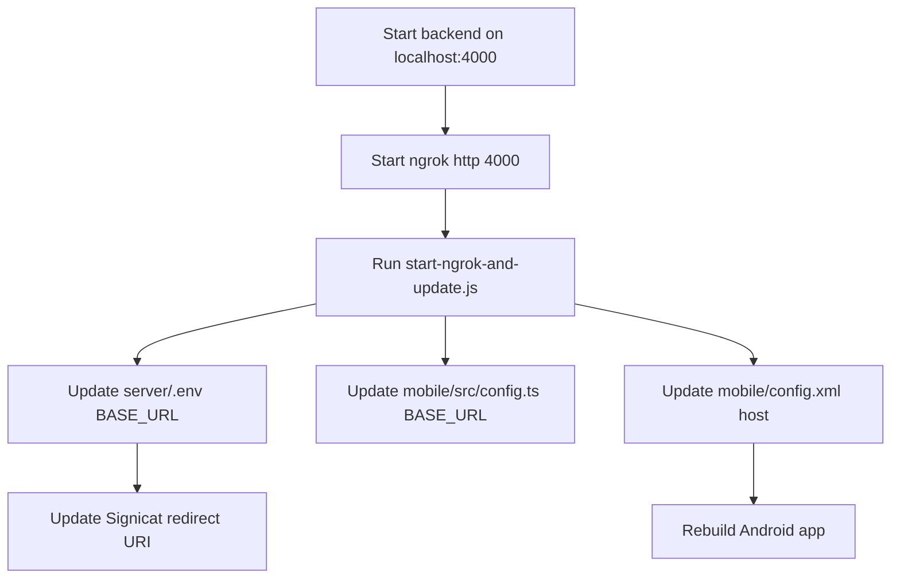

# SPID-Style SSO PoC Stakeholder Brief

This document summarizes the SPID-style SSO PoC built with a React + Ionic + Cordova Android app and a Node.js (TypeScript) backend using the Signicat sandbox. It explains what we achieved, the approach, the implementation choices, and why those choices were made. It also includes architecture and data flow diagrams.

---

**Executive Summary**

We built a production-aligned SPID-style authentication flow where the mobile app never handles Signicat access tokens directly. Instead, the backend performs OIDC Authorization Code + PKCE with Signicat, validates the ID token, and then mints an app-specific JWT for API access. The flow works end-to-end on Android using App Links and a custom scheme fallback to address ngrok free domain changes.

---

**Objectives**

1. Implement a production-style login with Signicat sandbox using OIDC Authorization Code flow.
2. Keep the mobile app insulated from IdP tokens.
3. Make ngrok free usable by auto-updating BASE_URL and providing a fallback deep link mechanism.
4. Ensure future production migration only requires changing BASE_URL and Signicat redirect URI.

---

**What We Built**

1. **Node.js TypeScript backend** in `server/` that:
   - Performs OIDC discovery and code exchange with Signicat.
   - Validates ID token + nonce.
   - Enforces PKCE.
   - Mints and verifies an app JWT.
   - Serves a dynamic `/.well-known/assetlinks.json`.
2. **Ionic React + Cordova Android app** in `mobile/` that:
   - Launches SPID login in the system browser.
   - Receives the callback via App Links or custom scheme fallback.
   - Exchanges the code with the backend and stores the app JWT.
   - Calls a protected `/api/me` endpoint.
3. **ngrok update script** in `scripts/` that:
   - Detects ngrok public HTTPS URL.
   - Updates server and mobile config for BASE_URL.
   - Updates App Links host configuration.
4. **Comprehensive setup and troubleshooting guide** in `README.md`.

---

**Architecture Overview**

```mermaid
flowchart TD
  U["User"] --> A["Android App (Ionic + Cordova)"]
  A -->|Open system browser| B["/auth/spid/start (Backend)"]
  B -->|Redirect| C["Signicat OIDC Authorize"]
  C -->|Redirect| D["/auth/callback (Backend HTML)"]
  D -->|App Links| A
  D -->|Custom Scheme Fallback| A
  A -->|POST /auth/exchange| B
  B -->|Code Exchange + ID Token Validation| C
  B -->|Mint App JWT| A
  A -->|GET /api/me (Bearer JWT)| B
```

---

**Key Design Decisions and Rationale**

1. **Authorization Code Flow with PKCE**
   - Reason: Modern mobile security best practice.
   - Outcome: Signicat accepts requests and mitigates authorization code interception.

2. **Backend-minted JWT**
   - Reason: App APIs should not depend on Signicat tokens.
   - Outcome: Separation of concerns and easier provider swap.

3. **App Links + Custom Scheme Fallback**
   - Reason: ngrok free domain changes break App Links host matching.
   - Outcome: App Links are used when possible. The fallback ensures the app still opens.

4. **Dynamic Asset Links**
   - Reason: App Links require current host mapping.
   - Outcome: `/.well-known/assetlinks.json` is generated at runtime using env values.

---

**Implementation Details**

**Backend Components**

1. **OIDC Client Setup**
   - `openid-client` with discovery from `SIGNICAT_ISSUER`.
   - `redirect_uri` is always `BASE_URL/auth/callback`.

2. **State + Nonce + PKCE**
   - State prevents CSRF.
   - Nonce ensures ID token is bound to this auth request.
   - PKCE adds proof-of-possession for the code.

3. **Token Exchange**
   - `POST /auth/exchange` receives `code` and `state`.
   - Server exchanges code at Signicat, validates ID token, and mints app JWT.

4. **Protected API**
   - `GET /api/me` validates the app JWT and returns user info.

**Mobile Components**

1. **Login Flow**
   - System browser via InAppBrowser plugin.
   - Deep link capture via App Links and `cordova-plugin-customurlscheme`.

2. **Callback Parsing**
   - Accepts any URL containing `code` and `state`.
   - Calls `/auth/exchange` to obtain app JWT.

3. **UI**
   - Login screen with status and last callback URL.
   - Home screen with user details and action buttons.

---

**Data Flow: Token Lifecycle**



---

**Architecture with Trust Boundaries**



---

**Operational Flow for ngrok**



---

**Key Endpoints**

1. `GET /health`  
2. `GET /auth/spid/start`  
3. `GET /auth/callback`  
4. `POST /auth/exchange`  
5. `GET /api/me`  

---

**Security Considerations**

1. State and nonce stored in memory to prevent CSRF and replay.
2. PKCE is mandatory for Signicat and secure mobile OIDC.
3. App JWT is short-lived and separated from IdP tokens.
4. App Links require correct SHA256 signature in asset links.

---

**Known Limitations**

1. In-memory session store is not persistent.
2. ngrok free requires reconfiguring Signicat redirect each restart.
3. Device token storage uses localStorage (replace with secure storage for prod).
4. App Links auto-open is not guaranteed with dynamic host.

---

**Next Steps for Production**

1. Use a stable domain with real TLS cert.
2. Replace in-memory store with Redis or DB.
3. Use secure storage for JWT on device.
4. Add structured logging and monitoring.
5. Add refresh tokens if long sessions are required.

---

**Appendix: Key Files**

1. Backend entry point: `/Users/vijay/projects/poc/ionic-spid-poc-cdx/server/src/index.ts`
2. Mobile app entry point: `/Users/vijay/projects/poc/ionic-spid-poc-cdx/mobile/src/App.tsx`
3. Deep link handling: `/Users/vijay/projects/poc/ionic-spid-poc-cdx/mobile/src/services/deepLink.ts`
4. ngrok helper: `/Users/vijay/projects/poc/ionic-spid-poc-cdx/scripts/start-ngrok-and-update.js`

