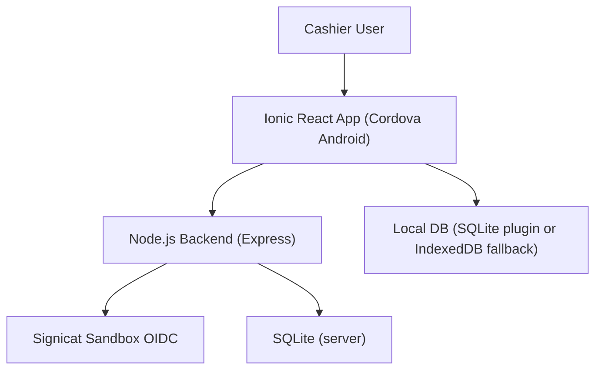
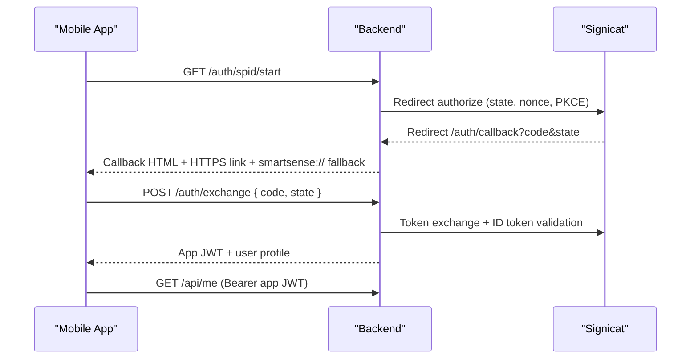
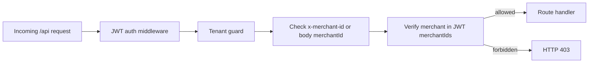
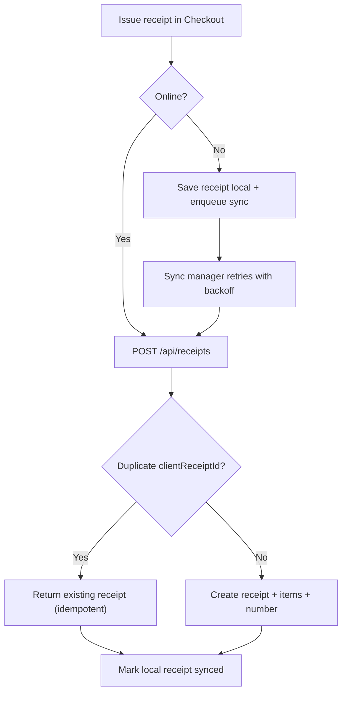

# Developer Implementation Guide

This document captures the current implementation status, architecture decisions, and operational flow for the SPID POS PoC.

## Scope delivered

- SPID sandbox auth via Signicat using OIDC Authorization Code + PKCE.
- Backend-only Signicat token handling; mobile receives only app JWT.
- Multi-merchant POS API surface with tenant guards.
- Offline-first local DB and sync queue in mobile app.
- Side-menu navigation and i18n (`en`, `it`, `de`).
- Persisted settings flows for Payments, Printer, Reports, Support.
- Backend integration tests for tenant isolation and receipt idempotency.
- Audit logs for void/refund actions.

## Architecture overview



## Authentication flow



## Tenant isolation model



## Offline sync model



## Backend implementation details

### Security and API hardening

- `helmet` and `express-rate-limit` enabled globally.
- Strict CORS allow-list from config.
- `zod` validation for request params/query/body.
- JWT auth middleware injects authenticated user claims.
- Tenant guard enforces merchant membership before route handler.

### Receipt idempotency

- API expects `clientReceiptId` from mobile.
- DB enforces unique tuple `(merchant_id, client_receipt_id)`.
- Duplicate create request returns existing receipt (`200`, `idempotent: true`).

### Audit logging

- `void` and `refund` service paths emit structured log entries.
- `sync_events` captures state changes and `actedByUserId` metadata.

### Integration tests

- File: `/Users/vijay/projects/poc/ionic-spid-poc-cdx/server/src/tests/api.integration.test.ts`
- Scenarios:
  - cross-merchant access denied
  - same-merchant access allowed
  - duplicate `clientReceiptId` does not create duplicate rows

Run:

```bash
cd /Users/vijay/projects/poc/ionic-spid-poc-cdx/server
npm run test:integration
```

## Mobile implementation details

### UX structure

- Side menu (`IonMenu`) with POS pages and settings routes.
- Page scaffolding with online/offline badge.
- Reusable `EmptyState` and `ListSkeleton` for clearer loading/empty UX.

### Persisted settings

- Settings context persists local values for:
  - payments methods and default payment
  - printer selection/connection/test metadata
  - report export metadata
  - support preferences and draft notes

### Data layer

- Local DB abstraction prefers SQLite plugin on device.
- IndexedDB fallback for browser/dev environments.
- Sync queue stores pending receipts and retry metadata.
- Sync manager auto-runs on connectivity restore.

## Current runbook

1. Start backend (`npm run dev` in `server`).
2. Start ngrok (`ngrok http 4000`).
3. Run URL sync script (`node scripts/start-ngrok-and-update.js`).
4. Update Signicat redirect URI to `https://<ngrok>/auth/callback`.
5. Build/run app (`ionic build`, `npx cordova run android`).

## Known limitations

- ngrok free host changes still require app rebuild for HTTPS app-link host match.
- JWT storage is not yet migrated to secure storage plugin.
- Printer integration is simulated; no hardware SDK binding yet.
- CSV export uses client-side file generation.

## Next recommended increment

1. Replace localStorage token handling with secure storage plugin.
2. Add backend integration tests for void/refund authorization and audit event writes.
3. Add background sync observability (last run, last failure reason in UI).
4. Introduce migration path from SQLite to PostgreSQL repositories.
